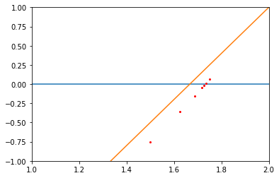

## Bisection Method

Suppose that `f` is a continuous function defined in `[a, b]` with `f(a)` and `f(b)` of opposite sign. That theorem implies that a number `p` exists in this interval with `f(p) = 0`.  
One aprox of `p` is: `p = a + (b - a)/2`. 

### Example and Result
Assuming that `f(x) =  x^2 - 3` the value of p is `1.7265625` after 7 iterations. The following graph represents a aproximation of p in relation with that function.  

